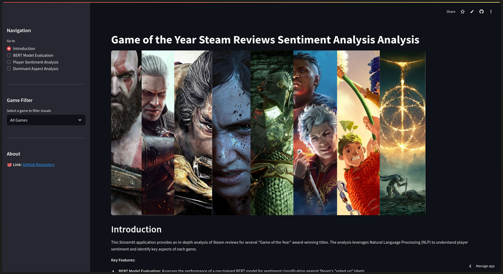
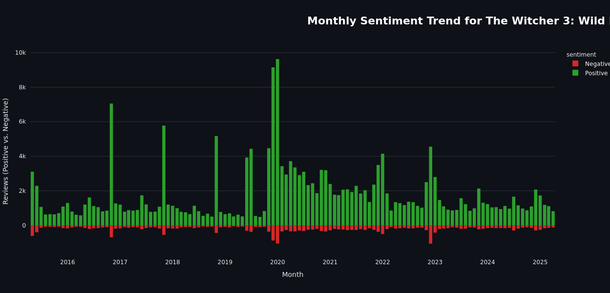
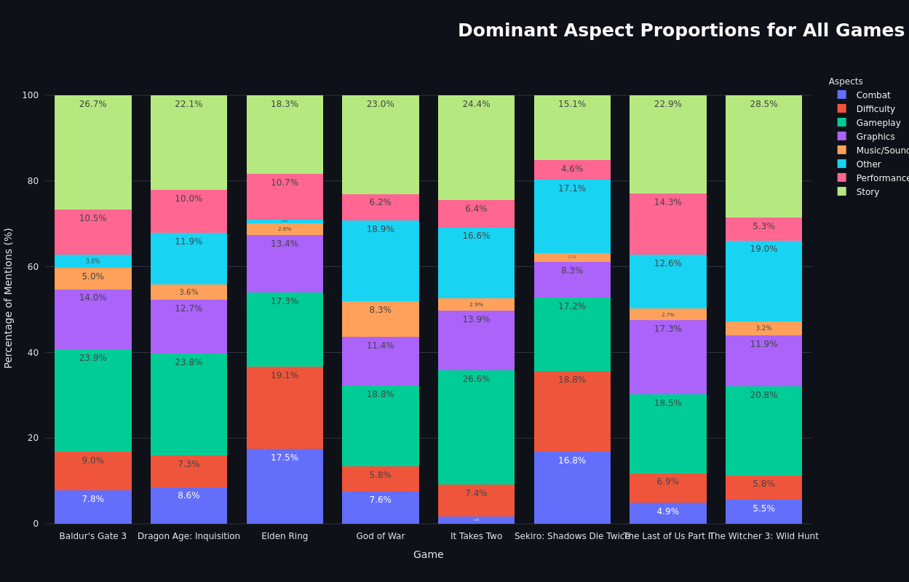

<div align="center">
  
</div>

# Sentiment Analysis of Game of the Year Reviews on Steam
This repository contains the source code, analysis, and resources for the undergraduate thesis titled **"Sentiment Analysis of Game of the Year (GOTY) Reviews on the Steam Platform using BERT"**. The project aims to analyze user sentiment for GOTY-winning games to explore the potential divergence between critical acclaim and player perception.

---

### Technology Stack
<div align="center">
  
  
  
  
  
  
  
  
  
  
</div>

---

### 📊 Interactive Dashboard
An interactive dashboard has been developed using **Streamlit** to explore the dataset and model predictions dynamically. You can filter by game, view sentiment distributions, and analyze key aspects in real-time.

**[➡️ Click here to access the Streamlit Web App](https://goty-sentiment-analysis.streamlit.app/)**




---

## 📈 Visualizations & Key Findings
The analysis of over 650,000 user reviews reveals key trends in player sentiment and the aspects they discuss most.

#### Sentiment Trend Over Time
The volume of positive (green) and negative (red) reviews evolves after a game's launch, often peaking initially and fluctuating with sales, updates, or community discourse.

<div align="center">
  
</div>

#### Dominant Aspect Proportions
The focus of discussion varies significantly between games. While some are praised for their story, others are discussed more for their difficulty and combat, showcasing unique player priorities for each title.

<div align="center">
  
</div>

### Summary of Findings
- While the overall sentiment towards GOTY-winning games is predominantly positive (with a model accuracy of **~89%**), there is significant variance in reception between different titles.
- **Story** and **Gameplay** are the most frequently discussed aspects across all reviews.
- **Positive reviews** often highlight **Story**, **Gameplay**, and **Graphics**.
- **Negative reviews** frequently focus on **Performance** issues (bugs, crashes, optimization) and **Difficulty**.

---

## 🔬 Methodology Overview

* **Data Source:** User reviews for GOTY winners (2014-2024) were collected from the Steam platform via **web scraping**.
* **Core Model:** Sentiment analysis was performed using the `nlptown/bert-base-multilingual-uncased-sentiment` model from the Hugging Face Transformers library.
* **Long Text Handling:** A content selection strategy was implemented to process reviews exceeding BERT's 512-token limit by creating a representative summary from the start, middle, and end sections of the original text.
* **Key Analyses:**
    * **Sentiment Classification:** Classifies each review into a binary sentiment (Positive or Negative).
    * **Sentiment Trend Analysis:** Visualizes the volume of positive and negative reviews over time to identify how player perception evolves post-launch.
    * **Dominant Aspect Identification:** Identifies and quantifies the most frequently discussed aspects of the games (e.g., Story, Gameplay, Performance, Difficulty) within positive and negative reviews.

---

## 📂 Repository Content
- **/data**: Contains the CSV files with aspect counts for positive, negative, and all reviews.
- **/img**: Contains images and visual assets used in the README and project.
- `data_analysis.ipynb`: The main Jupyter Notebook with the full analysis pipeline.
- `analysis_with_version_control.ipynb`: Additional analysis.
- `requirements.txt`: A list of Python libraries required to run the project.

---

## 🚀 Setup and Usage

### 1. Running the Analysis Notebook
1.  Clone the repository:
    ```bash
    git clone https://github.com/Fakur19/goty-sentiment-analysis
    cd goty-sentiment-analysis
    ```
2.  Create a virtual environment and install the required packages:
    ```bash
    python -m venv venv
    source venv/bin/activate  # On Windows, use `venv\Scripts\activate`
    pip install -r requirements.txt
    ```
3.  Launch Jupyter Notebook and open `data_analysis.ipynb` for whole analysis and `analysis_with_version_control.ipynb` for analysis with patch/update/dlc for each game.
    ```bash
    jupyter notebook
    ```
---